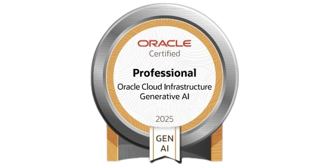
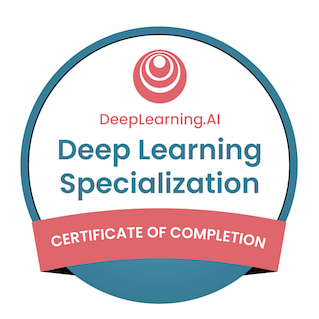

<!-- TOP WAVE -->

<!-- Animated Intro -->

  

<h1 align="center"><b>A U N &nbsp; R A Z A</b></h1>

  

  Machine Learning Engineer • Generative AI • Systems Architect

  
  
  
  

## Tech Radar

### Core Languages

### Machine Learning & Deep Learning

### NLP & Generative AI

### Systems & Backend

### Cloud & Infrastructure

## Experience

### Associate AI Engineer — Krank Tech  
Feb 2026 – Present  

- Real-time multimodal inspection system using GPT Realtime API  
- WebRTC + WebSockets streaming architecture  
- Reduced operational cost by 25 percent via orchestration optimization  
- OCR + damage detection + automated workflows  
- Multilingual AI deployment  

---

### Junior AI Engineer — SIBERNETICS LLC  

- Multi-tenant AI SaaS platform  
- Production-grade RAG pipeline  
- Agent orchestration system  
- Flask + PostgreSQL backend  
- Document ingestion + API agent  

##  Certifications & Achievements

<table align="center">
<tr>
<td align="center">

</td>

<td align="center">

</td>

<td align="center">

</td>
</tr>

<tr>
<td align="center">

</td>

<td align="center">

</td>

<td align="center">

</td>
</tr>

<tr>
<td align="center">

</td>

<td></td>
<td></td>
</tr>
</table>

<i>✨ Click any certificate to verify</i>

## Activity

  

  

## What I’m Building

- Open-source LLM-based RAG systems  
- Multi-agent orchestration workflows  
- Real-time multimodal AI applications  

## Contact

- Email: syedaunrazarizvi3@gmail.com  
- LinkedIn: https://linkedin.com/in/aun-raza  

<!-- BOTTOM WAVE -->

